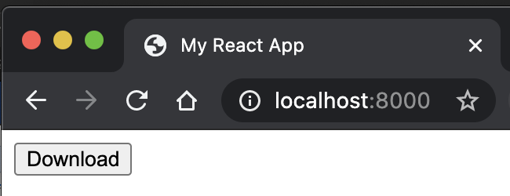

#  POC step by step
``` zsh 
git clone https://github.com/rondinif/react-data-export-dataset-poc.git
cd react-data-export-dataset-poc
npm i
npm --ignore-scripts=false run build
# serve the dist folder
# navigate to the page and press export button
# open the downloaded xlsx
```





# references
## related question 
- https://stackoverflow.com/questions/62071731/export-two-excel-data-into-single-excel-sheet-by-adding-heading-and-some-calcula/62132131#62132131

## related answer 
https://stackoverflow.com/a/62132131/1657028

<!-- 
## references used for the poc 
https://medium.com/@paul.allies/react-create-app-without-react-create-app-7c8341282645
### .gitignore
https://raw.githubusercontent.com/facebook/react/master/.gitignore
### basic reactdom example 
https://stackoverflow.com/questions/40407632/how-to-render-a-react-component-using-reactdom-render
https://stackoverflow.com/a/40408239/1657028
https://stackoverflow.com/a/43028918/1657028
-->
